<pre align="center">
<strong>Benedek A. Rozemberczki/</strong> <a href="https://www.labri.fr/perso/nrougier">Homepage</a> / <a href="https://twitter.com/benedekrozemberczki">Twitter</a> / <a href="https://www.reddit.com/user/benitorosenberg/submitted/?sort=top">Reddit</a> / <a href="https://github.com/benedekrozemberczki">GitHub</a> / <a href="https://scholar.google.com/citations?user=pa8DvbkAAAAJ&hl=en&oi=ao">Google Scholar</a></pre>

<a href="https://metrics.lecoq.io/about/benedekrozemberczki"></img></a>
<a href="https://metrics.lecoq.io/about/benedekrozemberczki"></img></a>
  
### :sparkler: Welcome stranger :sparkler:
- :alarm_clock: Currently working on machine learning for temporal and dynamic graph structured data.
- :robot: I would love to collaborate on [PyTorch Geometric Temporal](https://github.com/benedekrozemberczki/pytorch_geometric_temporal).

### :fireworks: Great news :fireworks:
- :crystal_ball: [The Shapley Value of Classifiers in Ensemble Games](https://arxiv.org/abs/2101.02153) was accepted in CIKM 2021.
- :diamonds: [PyTorch Geometric Temporal](https://arxiv.org/abs/2104.07788) was accepted in CIKM 2021.
